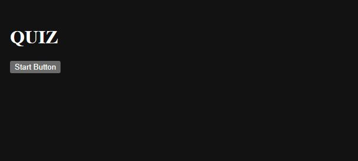

# Quiz Game

## Description

This page will serve as a game about colors

## Table of contents

-[Timer](#timer)
-[Game Start](#game)
-[Game Over Screen](#gameOver)
-[Score Screen](#scores)

## Installation

This page shows the repository used: https://github.com/KobyS82/Color-Quiz

## Usage

This page can be viewed at https://kobys82.github.io/Color-Quiz/

 

## Credits

Alexis San Javier, UT Tutor, for helping with intervals and funtion delegation.

Stack Overflow, for fixing GitHub errors, https://stackoverflow.com/questions/30443333/error-with-renamed-repo-in-github-remote-this-repository-moved-please-use-th

Log Rocket, for localStorage usage, https://blog.logrocket.com/localstorage-javascript-complete-guide/#setitem

Bradley O'Dell, Bootcamp TA, for helping with stupid GitHub incursive repo error.

